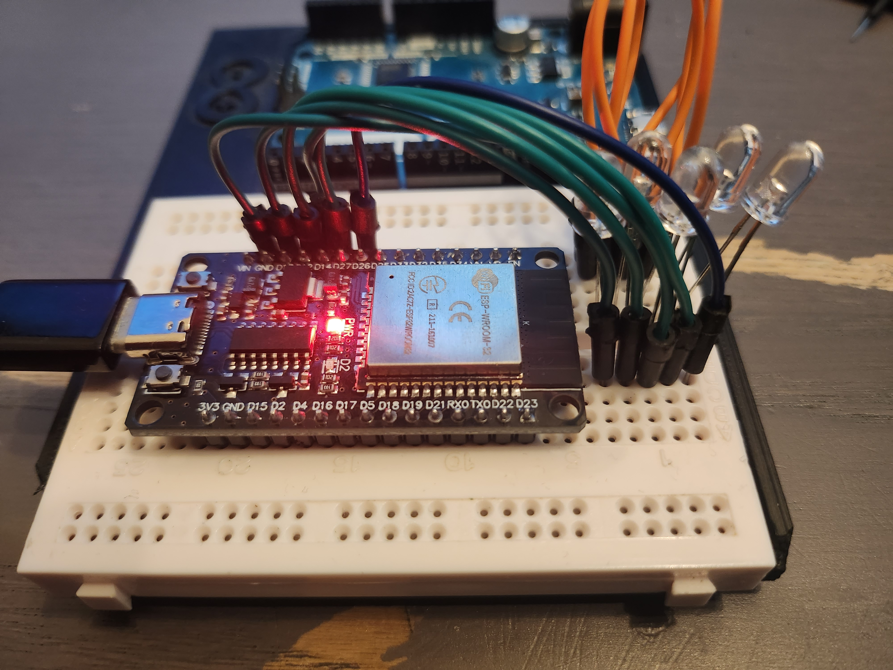
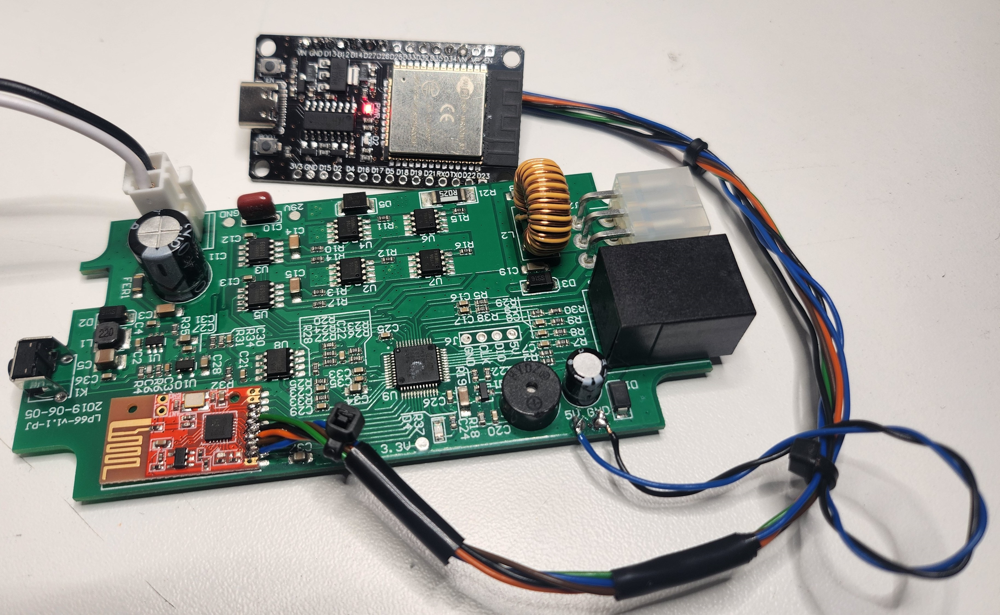
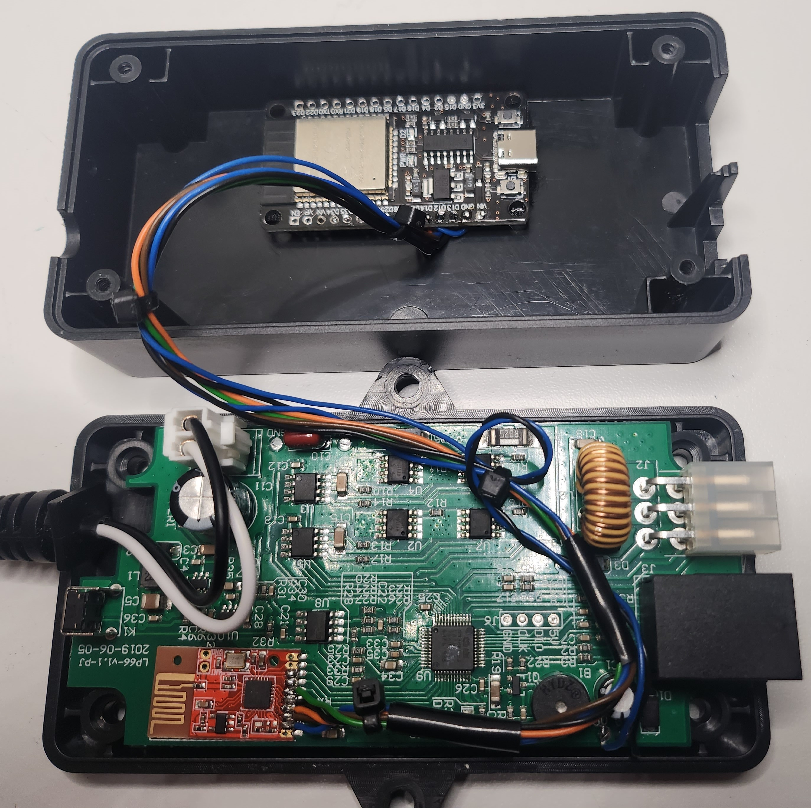

# Solution
After understanding how the connection between remote and control unit works, I should be able to create a soulution using the ESP32.
The idea is to wire the ESP32 in paralell to the pins coming out from the receiver board, and replicate the commands from remote.

## HomeAssistant configuration
HomeAssistant was installed on a Raspberry Pi 4, 8GB.
I followed [this guide](https://www.home-assistant.io/installation/raspberrypi) to get it installed and set up.

## ESPHome Configuration
Once HomeAssistant was installed I followed [this guide](https://www.esphome.io/guides/getting_started_hassio) to install the ESPHome Add-on to HomeAssistant.
Once the add-on was installed I used the "New Device" button in the ESPHome, and then the web-portal to set up the ESP32 device for the first time.
After this was configured the first time, I used the "Edit" button in HomeAssistant for the rest of the configuration.

## Test setup

Before making any permanent changes to the control unit, I connected the ESP32 to some LEDs on a breadboard. This way I could see that I was making the correct bit-patterns on the GPIO-pins.  
After some experiments I figured out how to seup switches in HomeAssistant and how to set the correct bit pattens on the GPIO.  
  
  

The resulting code can be found [here](ESP32_Config.yaml).
The code can be used by pasting it in to the .yaml file of your ESP32 below the code that is created during setup of the ESP32-device. I have made the HomeAssistant switches momentary, so that they will automaticaly turn off after 500ms. I probably have to tune this once the control unit is connected to the linear actuator.

To adapt this to your needs, the GPIO pin numbers may need to be adjusted. 

## TV-Lift modifications
Once I was happy with the testing done on the breadboard, i soldered the ESP32 module on to the control unit using jumper wires i attached to the solderpads of the receiver module.
The other end was soldered to the correct pin on the ESP32 board.
For convenience i selected the following pins and connected them to the receiver module:
GPIO13 -- B1  
GPIO12 -- B2  
GPIO14 -- B3  
GPIO27 -- B4  
GPIO26 -- B5  
5V -- 5V on controlboard  
GND -- GND on controlboard  
  

Once everything was connected, I tidied up the wiring, and glued the ESP32-device to the inside of the case using velcro tape. The control unit was the re-assembled and connected to the tv-lift for final testing.

The final result:

