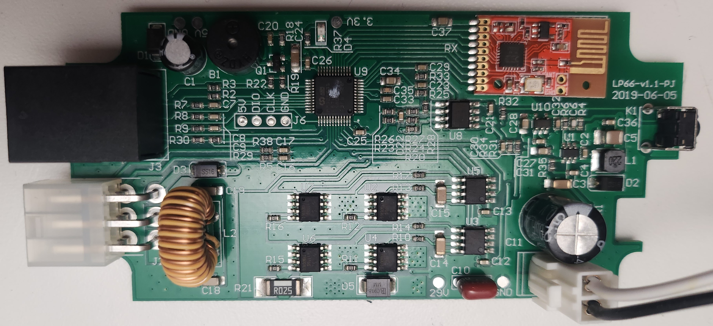

# Reverse Engineering the TV-lift
This part details the steps performed to reverse engineer enough of the tv-lit to be able to duplicate the commands using a ESP32 board. The tv-lift itself is built into the end of my bed. Hopefully I will only need the control boxses to figure out a solution.

- The tv-lift I am trying to hack is this one: [TV-Lift](https://nedis.no/no-no/product/lyd-og-bilde/ridedyr/tv-bevegelse/550712741/motorisert-tv-stand-37-65-maximum-skjerm-vekt-50-kg-innebygd-skapdesign-heis-rekkevidde-68-158-cm-fjernstyrtkontrolert-abs-stal-sort).
It looks like this kind of tv-lift is fairly generic, and is sold under many different labels.

- Manual for the tv-lift can be found here: [Manual](https://cdn.nedis.com/datasheets/TVSM5830BK_MAN_COMP_0120_web.PDF)

## Remote Control
The remote is easy to take apart, and is how i dicovered that my RF-bridge was working with a different kind of RF.
There isnt much going on. Just buttons going back to the small transmitter board.
The chip on the board is a Beken BK2461. And Google tels me this might be a l24yk 2.4GHz 6-channel Wireless Transmitter module.

## TV-Lift
The linear actuator that actually lifts the tv is mounted into the end of my bed. Since this is quite a task to remove, I have only removed the power brick and the control unit. The power brick looks fairly standard except the output voltage at 29V. There is no need to disassemble the power brick since it will not be modified.

Disassembly of the Control unit was just four screws, and the box came apart easily.
The circuit board inside looks quite simple:

First step was to find a source for 5V where I can power the ESP32 board from.
There are a few point labeled 5V and GND on the board. I decided that the points next to the buzzer(B1) and capacitor C1 is a good source since this is powered as soon as the power is connected to the control unit.

Next step is to see if I can recognize the remote control commands on the outputs of the receiver module(RX).
According to the datasheet for the transmitter/receiver modules ([Datasheet](./L24YK_Datasheet.pdf)), it looks like an input on the transmitter module will activate the corresponding output on the receiver module for pins B1-B6. 
Pin B1 is pin number 2 from the top when looking at the previous picute of the control board.

I measured the voltage between GND and B1-B6 while pressing each button on the remote. I made notes of the active pins for each button, and put them into a table. The table seemed very random until i arranged the collums by the button numbers printed on the circuit board of the remote.

Pins to remote control button mapping:

|Pin/Button|1 (K1)| Left (K2)|Down(K3)|OK (K4)|Up(K5)|Right (K6)|1Mem (K7)|2 (K8)|2Mem(K9)|
| --- | --- | --- | --- | --- | -- | --- | --- | --- | --- |
|B1|X |X |NA|NA|NA|NA|NA|NA|NA|
|B2|NA|X |X |X |NA|NA|NA|NA|NA|
|B3|NA|NA|NA|X |X |X |NA|NA|NA|
|B4|NA|NA|NA|NA|NA|X |X |X |NA|
|B5|NA|NA|NA|NA|NA|NA|NA|X |X |
|B6|NA|NA|NA|NA|NA|NA|NA|NA|NA|
|B6|NA|NA|NA|NA|NA|NA|NA|NA|NA|

- B7 is connected to the button K1 on the control unit for pairing of the remote. Press the button for pairing. Hold the button for >5 sec. to clear paired remotes.
- B8 is connected to VCC to set the receiver to non-latching outputs.

Now I just need to see if I can replicate the signals on B1-B5 by using an [ESP32](../Solution/Solution.md)
